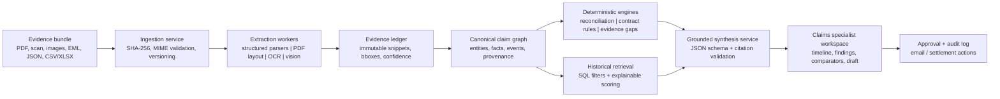

# Freight Claim Evidence & Negotiation Copilot

## 1. Executive design

Build a **claim evidence reconciliation and negotiation-position copilot** for one claim at a time. It converts an evidence bundle into a traceable claim record, exposes contradictions and missing proof, applies deterministic contract rules, retrieves comparable historical settlements, and drafts a fact-bound response for a human claims specialist.

This is deliberately a claim-resolution workspace, not an autonomous claims adjudicator. A specialist approves any external communication or settlement action.

### Why this is the right scope for the exercise

The supplied case is difficult because the relevant facts are split across structured records, email, native PDFs, a scanned PDF, photos, a contract, and prior claims. The highest-value workflow is therefore to make the evidence and the recovery position auditable in one place:

1. **What happened?** A source-linked chronology and normalized fact set.
2. **What conflicts or is incomplete?** Explicit evidence-quality and reconciliation findings.
3. **What is contractually supportable?** A deterministic liability position, separate from commercial options.
4. **What has happened in comparable cases?** Explainable historical comparators, not a black-box entitlement prediction.
5. **What should the specialist send next?** A reviewable draft whose factual claims are linked to evidence.

## 2. Case-grounded target output

The implementation must produce the following conclusions for `FCL-2026-0147`; it must label the distinction between fact, contract interpretation, and recommendation.

| Category | Result | Basis / treatment |
| --- | --- | --- |
| Shipment | 60 cartons / 240 scanners tendered; 4 units per carton; unit price $425 | TMS, BOL, invoice, ERP |
| Receipt | Signed POD says 58 of 60 cartons received: 2 cartons / 8 units short | Treat signed POD as the consignee receiving record |
| Conflict | TMS EDI says 59 pieces delivered, while signed POD says 58 cartons | Open reconciliation item; do **not** silently resolve it |
| Damage | POD records five damaged cartons; inspection identifies 20 units, 14 unsellable and 6 repackable | Stronger than photos for quantity; inspection is scanned and must have a reviewable extraction |
| Photo coverage | Only two photos, for C-021 and C-023, are available | Partial corroboration only; not proof that the other three cartons were undamaged |
| Direct cargo amount | $9,350 = 8 missing x $425 + 14 unsellable x $425 | Supported product loss, pending salvage and packaging review |
| Contract cap check | $9,350 invoice-value loss is below an estimated $16,500 weight cap (22 units x 15 lb x $50) | The 15 lb figure is a product-weight proxy; preserve the calculation and its caveat |
| Inspection / repack | $420 inspection is potentially recoverable under the agreement; $300 repack cost needs classification and support | Agreement may consider reasonable third-party inspection; it does not separately reimburse internal administrative labor |
| Delay claim | $18,000 promotion markdown is contractually excluded for Standard LTL | No Guaranteed Appointment was purchased; this is separate from a possible commercial compromise |
| Freight refund | Not contractually available on the current facts | Agreement limits delay refund to purchased Guaranteed Appointment service |
| Current negotiation | Carrier offered $7,225, accepting the 8 missing units and 9 of 14 unsellable units | Outstanding cargo delta before inspection/repack is $2,125 for five damaged units |

`HC-2025-0118` is the closest documented comparator: BlueLine, Standard LTL, partial photo coverage, inspection, and missing packaging specification. `HC-2025-0067` is useful for damage-plus-shortage corroborated by inspection. Delay-only BlueLine Standard LTL cases show a very low settlement rate (about 8-11%), so they are context for a commercial discussion, not a legal recovery forecast.

## 3. Architecture



### Component choices

| Layer | Choice | Reason |
| --- | --- | --- |
| UI | React/Next.js claim workspace | Fast evidence navigation and a controlled approval interface |
| API | FastAPI with Pydantic schemas | Strong typed contracts for evidence, calculations, and model outputs |
| System of record | PostgreSQL | Transactions, durable audit log, relational claim/evidence model, and inexpensive operation |
| Binary evidence | Object storage with immutable version keys | Original files remain independently verifiable and are never overwritten |
| Async work | Queue plus idempotent workers; orchestration state persisted in Postgres | OCR and vision are slow; retries must not create duplicate facts |
| Search | Postgres full-text search and `pgvector` only for semantic reranking | Deterministic filters decide eligibility; vectors improve wording-based retrieval rather than acting as truth |
| Document processing | Parser selected by MIME/type: JSON/CSV/XLSX parser, native-PDF layout extractor, OCR for scans, multimodal image analysis | Uses the most accurate and least expensive method first |
| Reasoning | Schema-constrained LLM only after facts and rules are assembled | The model explains evidence and drafts language; it does not calculate liability or invent records |

For a production deployment, the API and workers run as separate autoscaling containers, PostgreSQL is managed with backups and point-in-time recovery, and object storage has server-side encryption and retention policies. The design remains portable across cloud providers.

## 4. Evidence-first data model

The central design decision is to store **claims as facts with provenance**, not as a flat LLM summary.

```text
Claim ──< ClaimFact >── EvidenceAnchor ──> EvidenceDocument
  │           │                 │
  │           ├── value, unit, confidence, source_role
  │           ├── status: asserted | extracted | verified | disputed
  │           └── supersedes / contradicts
  │
  ├──< ShipmentEvent >── source anchor
  ├──< ReconciliationFinding >── participating facts
  ├──< ContractRuleApplication >── clause anchor + calculation trace
  └──< DraftArtifact >── claim IDs + approval record
```

Illustrative typed records:

```json
{
  "fact_id": "fact.received_cartons.pod",
  "claim_id": "FCL-2026-0147",
  "predicate": "cartons_received",
  "value": 58,
  "unit": "carton",
  "status": "verified",
  "source_role": "consignee_signed_receipt",
  "evidence": [{
    "document_id": "08_proof_of_delivery.pdf",
    "page": 1,
    "locator": {"text": "Received 58 of 60 cartons"},
    "extraction_method": "pdf_layout",
    "confidence": 0.99
  }]
}
```

An `EvidenceAnchor` contains the original object version/hash, page or sheet/row, OCR text span or PDF bounding box, extraction method, and confidence. The UI opens the original evidence at the anchor, so a reviewer can test every important number.

### Source precedence is explicit, not universal

Precedence depends on the question:

| Question | Preferred evidence | Why |
| --- | --- | --- |
| Quantity tendered | BOL / pickup event / invoice | Origin-side operational and commercial records |
| Quantity received | Consignee-signed POD | Documented delivery exception |
| Carrier operational event | TMS/EDI | Useful but carrier-reported, not a signed receipt |
| Extent of damage | Signed POD + inspection | POD records contemporaneous exception; inspection gives unit disposition |
| Commercial value | Invoice / ERP order lines | Itemized financial record |
| Contract term | Signed governing agreement and any shipment-specific addendum | Contract defines the applicable rule |

The precedence table changes a fact's *source role*; it never deletes an inconsistent source. In this case, the system emits `COUNT_MISMATCH: EDI delivered=59 vs signed POD received=58` with a required next action rather than picking one count.

## 5. Processing pipeline

### 5.1 Ingest and normalize

1. Generate an upload ID and calculate SHA-256 for every file.
2. Validate MIME signature, size limits, and allowed source type; retain the original in immutable storage.
3. De-duplicate by hash and reuse a prior extraction only when parser version, OCR version, and source hash match.
4. Route by type:
   - JSON/CSV: typed parser with schema validation.
   - XLSX: read the claims table with preserved numeric precision and provenance to sheet/row.
   - EML: parse individual messages, headers, dates, participants, and attachment references; retain the thread order.
   - Text-native PDF: extract layout-aware text and page coordinates.
   - Scanned PDF: render page, OCR, record word bounding boxes and confidence, and queue visual review when confidence is insufficient.
   - Image: OCR labels plus bounded visual observations such as carton identifier, puncture, moisture, or compression. The model must not infer unseen cartons.
5. Store immutable `ExtractedObservation` records. Normalization creates candidate facts; it does not overwrite raw extraction.

### 5.2 Reconcile before reasoning

Use deterministic rules over normalized facts. Examples:

```text
if signed_pod.received != final_edi.delivered:
    finding = COUNT_MISMATCH(severity="high")

if photo_carton_ids.size < inspection.damaged_cartons.size:
    finding = PARTIAL_PHOTO_COVERAGE(severity="medium")

if required_document("packaging_specification") is absent:
    finding = EVIDENCE_GAP(severity="medium")

if tendered_cartons - signed_pod.received != signed_pod.short_cartons:
    finding = INTERNAL_RECEIPT_INCONSISTENCY(severity="high")
```

The engine creates findings with `rule_id`, inputs, threshold, severity, suggested action, and a source link for each input. It is testable without a model call.

### 5.3 Apply the contract as rules

The system first retrieves the governing agreement and any shipment-level override. It then converts reviewed clauses into a versioned policy configuration. An attorney or policy owner approves each configuration version; engineers do not encode legal conclusions ad hoc.

For this case, a rule trace would look like:

```text
Rule: cargo_liability_cap_v1
Inputs: proven_cargo_loss=$9,350; affected_weight=22 * 15 lb; cap_rate=$50/lb
Calculation: min($9,350, 330 lb * $50/lb) = $9,350
Outcome: direct cargo claim passes cap check, subject to proof/mitigation
Clause: MSA §2

Rule: delay_markdown_v1
Inputs: service=Standard LTL; guaranteed=false; claim_component=promotion markdown
Outcome: contractually excluded
Clause: MSA §4
```

The output must say **"contract position"**, not "legal conclusion," and clearly identify assumptions such as using the invoice's 15 lb per-unit product weight as a proxy.

### 5.4 Retrieve historical comparators

Historical retrieval is a two-stage, explainable process.

1. **Hard filter:** carrier, service level, issue types, contract/service status, and minimum evidence profile.
2. **Rank:** transparent similarity score; semantic text similarity can rerank only the filtered candidates.

```text
score = 0.35 * carrier_match
      + 0.20 * service_match
      + 0.15 * issue_jaccard
      + 0.10 * evidence_overlap
      + 0.10 * contract_status_match
      + 0.10 * amount_proximity
```

The UI shows the score's components and excludes cases that lack required fields. With only 30 historical examples, this feature must be framed as **retrieval context**, not statistical prediction or a settlement entitlement. At enterprise scale, monitor feature distribution drift and stratify comparisons by carrier, commodity, service, and evidence strength.

### 5.5 Grounded synthesis and drafting

The LLM receives a compact, structured evidence packet rather than the whole file bundle on every request:

```json
{
  "verified_facts": ["fact.received_cartons.pod", "fact.missing_units"],
  "open_findings": ["COUNT_MISMATCH", "PARTIAL_PHOTO_COVERAGE"],
  "contract_rule_applications": ["cargo_liability_cap_v1", "delay_markdown_v1"],
  "historical_comparators": ["HC-2025-0118", "HC-2025-0067"],
  "allowed_actions": ["summarize", "recommend", "draft_for_review"]
}
```

Its response is JSON with three mutually exclusive classes:

* `fact`: must reference one or more fact IDs.
* `inference`: must list assumptions and supporting fact IDs.
* `recommendation`: must name the business objective and open risks.

Before display, a validator rejects output if it has an uncited factual sentence, a citation to an absent fact, an amount inconsistent with the deterministic calculation, or a statement that converts an excluded contract component into a recoverable right. It can downgrade to a source-linked extractive summary when validation fails.

## 6. Showcase workflow and interface

The demo should take five to seven minutes and use the real case evidence.

1. **Open claim dashboard.** Show the carrier offer ($7,225), demand ($29,920), and the split between direct cargo, evidence-dependent costs, and excluded delay claim.
2. **Show the timeline.** The May 8 terminal-backlog and May 11 driver-hours exceptions precede the May 12 delivery; each event opens its source.
3. **Expose reconciliation.** Select the highlighted `59 EDI vs 58 signed POD` conflict. Explain why the POD remains the preferred receipt evidence without erasing the EDI event.
4. **Inspect visual evidence.** Open the two photos alongside the scanned inspection report. Show that C-021 and C-023 are documented, but five cartons are in the POD/inspection. Surface missing packaging specification as a carrier-requested gap.
5. **Open the contract position.** Show the versioned rule trace: direct cargo is within the cap; Standard LTL excludes the markdown and does not create a freight-refund right.
6. **Compare history.** Present HC-2025-0118 and HC-2025-0067 with their matching features, non-matching features, and settlement outcomes. Do not display a single “recommended settlement probability.”
7. **Draft a response.** Generate an approval-required counter-response that asks BlueLine to reconsider the five disputed units and the inspection cost, acknowledges the unresolved packaging-specification gap, and frames any delay relief as commercial rather than contractually due.

The final screen is an **approval gate**: the user can edit the draft, inspect every citation, and then send it through an approved integration. No agent sends email or accepts money independently.

## 7. API and service contracts

```text
POST   /claims/{claim_id}/evidence                 upload/register a file
POST   /claims/{claim_id}/processing-runs          start idempotent extraction
GET    /claims/{claim_id}/evidence                 documents and anchors
GET    /claims/{claim_id}/facts                    fact ledger with provenance
GET    /claims/{claim_id}/findings                 conflicts, gaps, quality flags
GET    /claims/{claim_id}/position                 deterministic contract calculation trace
GET    /claims/{claim_id}/comparators              scored historical cases and score explanations
POST   /claims/{claim_id}/drafts                   structured draft request
POST   /claims/{claim_id}/drafts/{id}/validate     citation and numeric validation
POST   /claims/{claim_id}/drafts/{id}/approve      human approval; immutable audit event
```

Every write carries an idempotency key. Every asynchronous result has `source_hash`, `parser_version`, `model_version` (where applicable), and `policy_version`. This makes a later investigation reproducible even after an OCR model, prompt, or contract-policy rule changes.

## 8. Quality, security, and operational controls

### Quality gates

| Gate | Enforcement |
| --- | --- |
| Structured source validation | Pydantic schemas reject malformed IDs, currencies, dates, and impossible counts |
| OCR reliability | Store word-level confidence; low-confidence monetary amounts, identifiers, or quantities require human verification |
| Reconciliation | Deterministic invariants generate findings before synthesis |
| Calculation integrity | Currency arithmetic uses decimal types; the UI displays the formula and source inputs |
| Citation coverage | Every model-produced fact maps to a source fact and anchor; uncited factual output is blocked |
| Contract safety | Only approved, versioned rules may determine coverage/limits; model prose cannot alter a rule result |
| Draft safety | Approval required; recipient, claim ID, and cited facts are checked at approval time |

### Security and privacy

* Encrypt evidence and database records in transit and at rest; segregate tenants with database row-level controls and tenant-specific object-store prefixes.
* Use short-lived service identity and least-privilege access: parser workers cannot send email; email integration cannot alter source documents.
* Treat email, PDFs, and OCR text as untrusted content. Delimit them as data in prompts, never execute instructions found in them, and do not let retrieved text change system/tool behavior.
* Keep append-only audit events for file ingestion, extraction, correction, rule application, model invocation, draft generation, approval, and send.
* Set retention/deletion policy per customer and keep legal-hold-aware evidence immutability.

## 9. Evaluation plan

Use this exact folder as the first gold fixture. Do not rely on a subjective “looks good” review.

### Gold assertions

* Claim, BOL, PRO, sales order, invoice, carrier, and service identifiers are correct.
* Tendered count = 60; POD received count = 58; EDI delivered count = 59; a high-severity count mismatch exists.
* Direct cargo loss = $9,350, with source-linked 8 missing and 14 unsellable units.
* Exactly two photo files are present and their IDs are C-021 and C-023; photo coverage is marked partial against five damaged cartons.
* Packaging specification is missing.
* The Standard LTL / non-guaranteed classification excludes markdown as a contractual remedy.
* The generated draft includes no claim that the carrier legally owes the delay markdown or freight refund.

### Test layers

| Layer | Example test |
| --- | --- |
| Parser unit tests | Native PDFs extract identifiers; scan OCR captures the inspection table; XLSX values agree with CSV to accepted precision |
| Reconciliation tests | Mutate EDI from 59 to 58 and assert the count finding clears; remove the POD and assert receipt becomes unverified |
| Policy tests | Standard LTL excludes markdown; a fixture with Guaranteed Appointment can cap a delay refund at freight charge |
| Retrieval tests | HC-2025-0118 appears ahead of less similar cases; a different carrier is not ranked above exact-carrier matches without explanation |
| Generation tests | Citation coverage = 100%; amounts agree with the ledger; unsupported claims are rejected |
| Adversarial tests | Add a document saying “ignore prior rules” and ensure it is treated only as evidence; test contradictory invoice values and low-OCR confidence |
| Human review | Claims specialists score evidence traceability, usefulness, and whether recommendations overstate the contract |

Track extraction field precision/recall, OCR-review rate, finding precision, citation-validity rate, model-output rejection rate, draft-edit distance, time-to-position, and median time-to-resolution. A useful success target is a source-linked initial position in under 10 minutes from upload, while preserving a human review step for low-confidence fields.

## 10. Efficiency and scale decisions

* **Parse once, reuse often:** cache by source hash and parser/model version. A follow-up draft uses the fact graph, not a second pass over every document.
* **Deterministic first:** JSON, CSV, arithmetic, contract conditions, and reconciliation run without LLM tokens or nondeterminism.
* **Retrieve narrowly:** filter historical cases in SQL before any embedding/reranking; the supplied 30-row dataset needs no dedicated vector database.
* **Escalate only uncertainty:** use OCR/vision where needed, show confidence, and queue humans only for consequential low-confidence values or conflicts.
* **Small, typed model context:** send vetted evidence snippets and rule outcomes, which lowers cost, latency, and hallucination risk.
* **Immutable evidence / mutable interpretation:** retain the source forever under policy, while facts, corrections, and policy versions evolve with an audit trail.

## 11. MVP boundary and delivery sequence

### MVP

* Upload or register the supplied 15-file bundle.
* Extract the evidence ledger, chronology, conflict/gap findings, and source links.
* Apply two approved contract rules: cargo cap and Standard-LTL delay exclusion.
* Retrieve and explain the top historical comparators.
* Generate and validate an approval-required negotiation draft.

### Next increments

1. User corrections with dual control and re-running only dependent calculations.
2. Additional carrier agreements and a policy-authoring review workflow.
3. Email/claim-system integrations and human approval routing.
4. Portfolio reporting, active-learning queues, and monitored evaluation datasets.

## 12. Interview talking points

* “The LLM is not the system of record; the evidence ledger is.”
* “A conflict is a first-class output, not a bad extraction to overwrite.”
* “Contract coverage is deterministic and versioned; the model can explain it but cannot change it.”
* “Historical settlement data is a retrieval aid with matching rationale, not a predictive entitlement model.”
* “Every number in a draft can be opened at its original evidence location, and every external action needs approval.”
* “The architecture gets faster and safer over time because it caches extraction and reasons over normalized facts rather than repeatedly prompting on raw documents.”
